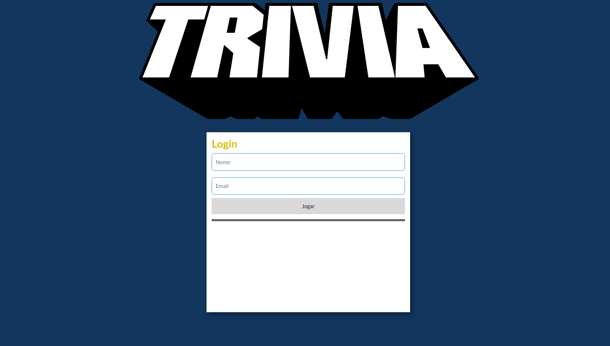
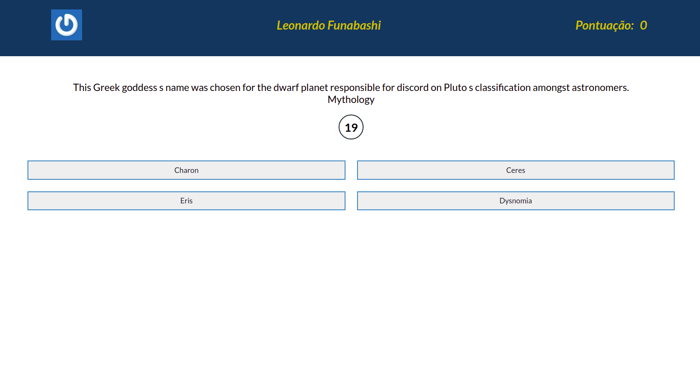
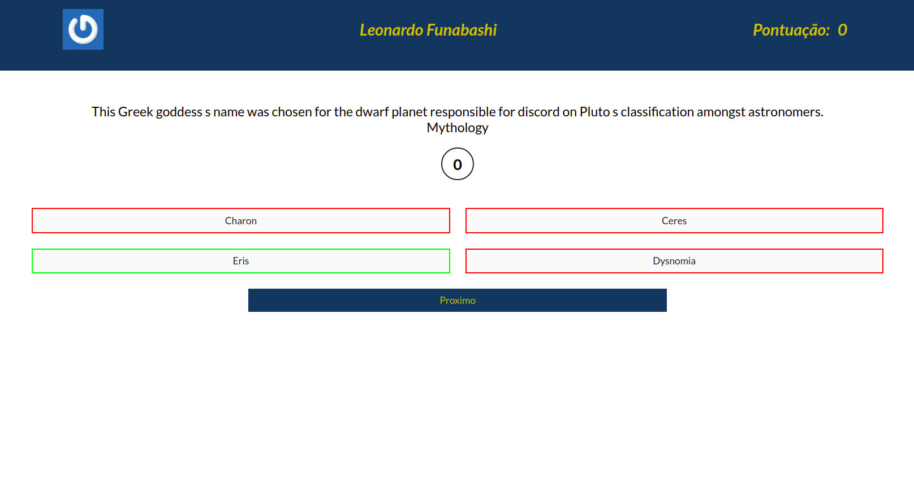
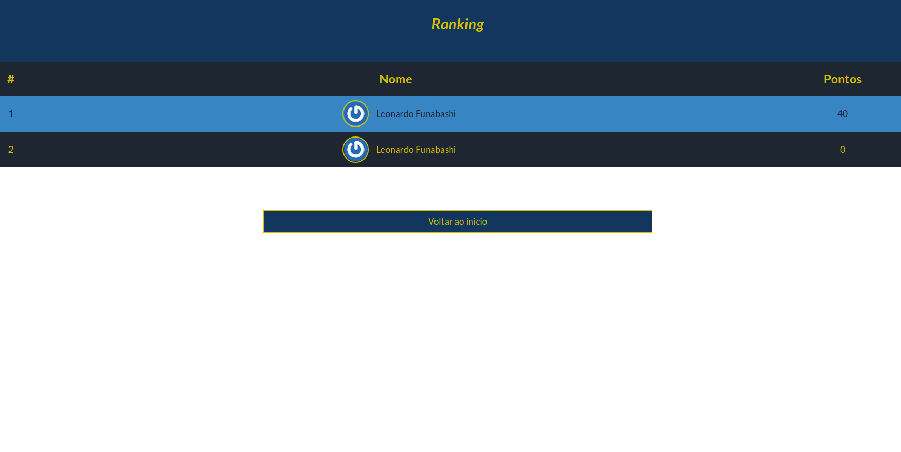

# Boas vindas ao repositório do projeto Trivia!

Olá seja bem vindo(a) ao meu projeto Trivia, esse projeto foi desenvolvido em grupo durante o curso da Trybe no módulo de Front-end usando React e Redux.

---

# Sumário

- [Habilidades treinadas](#habilidades-treinadas)
- [A aplicação](#a-aplicação)
- [Instruções para acessar o projeto](#instruções-para-acessar-o-projeto)
- [Acessar aplicação](#acessar-aplicação)

# Habilidades treinadas

- Manipular a biblioteca React

- Utilizar o Redux em aplicações React

- Trabalhar com assíncronicidade na aplicação React fazendo uso do Redux.

--- 
# A aplicação

  

  

  

---

## Instruções para acessar o projeto:

1. Clone o repositório
  * `git clone git@github.com:LeoFuna/trivia-project.git`.
  * Entre na pasta do repositório que você acabou de clonar:
    * `cd trivia-project`

2. Instale as dependências:
  * `npm install`

3. Inicialize o projeto:
  * `npm start`

---

# Acessar aplicação
- [Ver em funcionamento](https://leofuna.github.io/trivia-project/)
